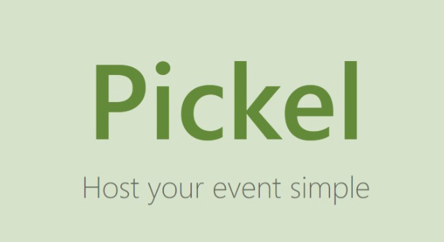

# Pickel
本專案為拖延已久之 程式導師實驗計畫 - 第四期 Final Project，此處僅包含專案規劃，前後端 Repo 可以點下方網址  


專案規劃網址：https://github.com/Lauviah0622/Pickel
前端 Repo：https://github.com/Lauviah0622/pickel-frontend  
後端 Repo：https://github.com/Lauviah0622/pickel_backend

## 目錄
1. 專案簡介
2. 專案說明
   1. 產品目標
   2. 使用流程
   3. 使用範例
3. 使用者敘述 User story
4. 產品名詞定義
5. 功能架構圖 Function map
6. 產品信息架構圖 IA
7. 線框稿 Wireframe
## 1. 專案簡介

Pickel 是一個選擇聚會時間的線上小工具，由一位主辦者發起活動後，讓能夠讓每一位活動的參與者都提出自己方便的時間區段，最後由活動的主辦者決定最後的活動時間。


## 2. 專案說明
挑日子的方式為什麼沒辦法選出合適的時間？

```
小明：好久沒約了各位～下禮拜要不要吃飯，約個晚上好了？
小美、小華：好啊 OK
小明：那我開個選日子，你們選一下自己 OK 的時間，不行的話可以自己新增選項。
```

〔小明建立了一個活動〕


```
小華：能不能再開一個星期三呀，那天可能會比較有空一點。
小明：好阿，我在重開一個挑日子好了
```
〔小明建立了一個活動〕

```
小美：這星期四跟星期五的時間可以，可是公司沒有那麼早下班，能不能再晚個半小時？
小明：err，好
```
〔小明建立了一個活動〕

> 提出選項再表決，很難提出大家都能滿意的選項


〔投票結束〕
星期六：小明、小華
星期五：小明、小美
星期四：小美
星期二：小明

小明：目前看起來是星期六和星期五比較 OK，不過就沒辦法全到，你們覺得呢？
小美：星期六我可能不行耶，那天要和家人出去。
小華：星期五喔...好啦我問問看我們主管，看看能不能稍微早一點走，可能要欠同事一次人情了。

> 表決常出現的問題，多個投票結果不知道要選哪一個，或者說：「不知道要如何犧牲」

小明：小華，我跟小美已經到了喔，你還沒到嗎？
小華：歹勢，我可能還要再半小時，你們先點餐，不用等我沒關係

> 有些人只能參與部分的時間，卻還是選擇了選項，影響其他人的參與


### 產品目標

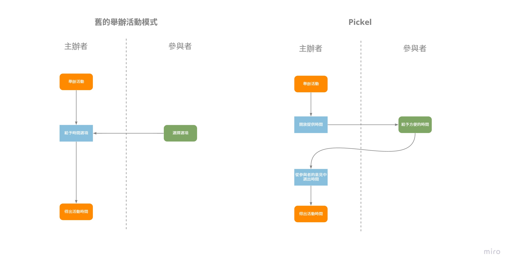

在過往的模式中，往往只有主辦者，或只有團體的少部份人提出少數的選項。最後進入表決的選項往往不夠好或者是沒辦法滿足大部分人的需求。

Pickel 的目標是：
> 用最簡單快速的方式，盡可能讓最多的成員能夠參與舉辦的活動。

主辦者能夠發送網址連結傳給想要參與的成員，讓成員能夠以簡單的圖形化界面來填入自己方便的時間。而在成員填寫完畢後，主辦者也能夠時間的統計資料來選出最多人能夠參與的活動時間。

### 使用流程

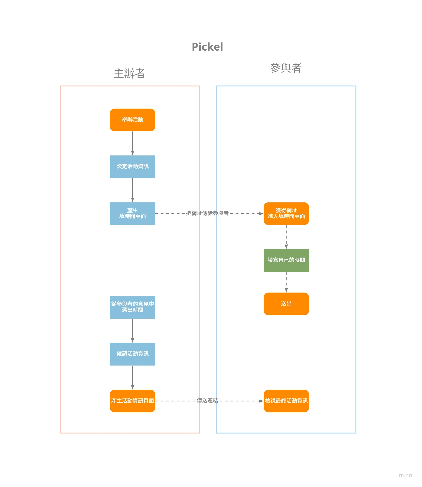


### 使用範例

> 因產品尚未完成，部份示意圖為 wireframe
#### 步驟一：主辦者建立活動
小明以及他的快樂夥伴們開始奮發向上，想要辦一場讀書會，想著想著決定用 Pickel 來選出這場讀書會的時間。

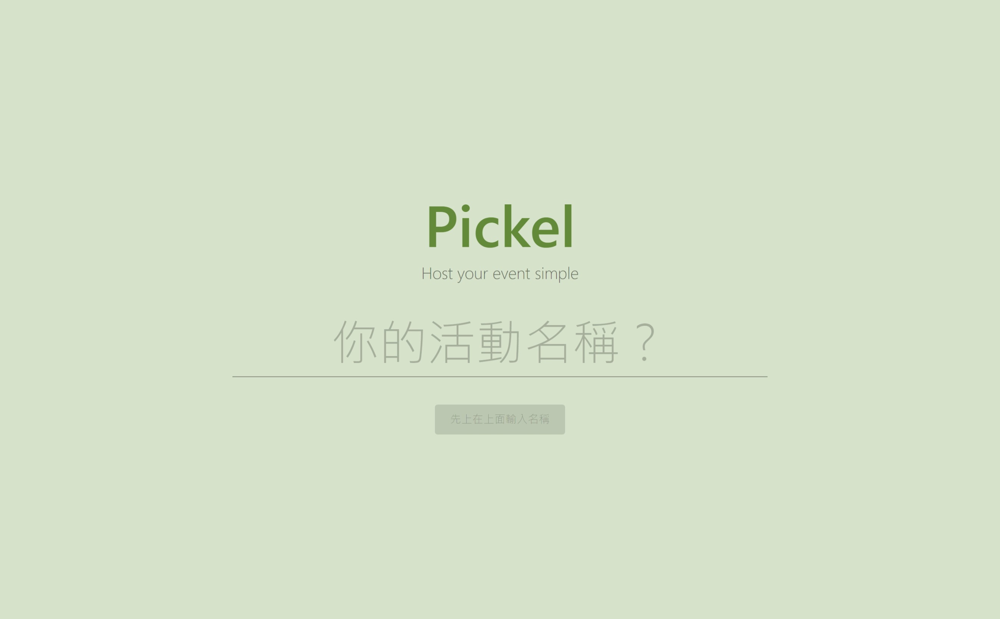

大家預計舉辦在平日的晚上： **12/5(一) ～ 12/9(五) 下午 5:00 到 晚上 10:00 之間**，而讀書會的時間預計為 **2hr**。於是小明可以發起一個活動，並設定：


```
- 活動名稱: 糞發項上讀書會  
- 活動主辦人: 用功的 AMing
- 預計活動時間: 12/4(日) ～ 12/9(二) 17:00 到 22:00 之間  
- 預計活動時長: 2hr   
- 填寫時間期限: 12/1(四) 9:00 ~ 12/5(五) 18:00
- 活動備註：在圖書館的閱覽室，帶自己要分享的書
```
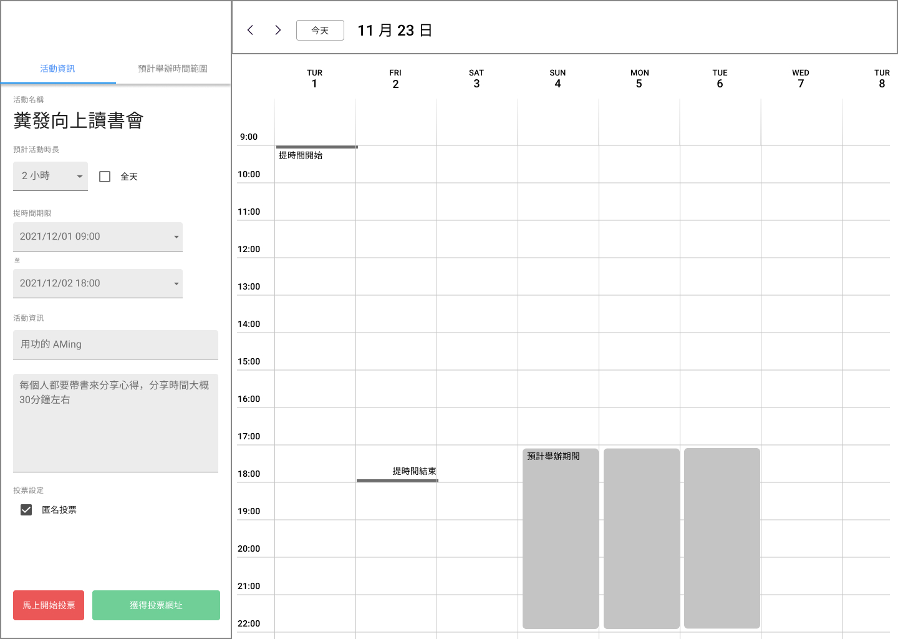


當它設定活動好之後，可以點擊 `獲得網址`，將這個活動的連結發給他的快樂夥伴們。也可以點擊 `馬上開始投票`，讓收到連結的夥伴可以馬上開始填入自己方便的時段。

#### 步驟二：參與者投票


小美點開收到的連結後，先填寫自己的名稱，就可以填寫預計活動時間內，自己方便參加的時間：

```
- 12/7 17:00 ~ 21:00 （最方便）
- 12/8 20:00 ~ 22:00 （如果可以盡量不要選擇這個時間）
- 12/9 17:00 ~ 18:30 （還 OK）
```
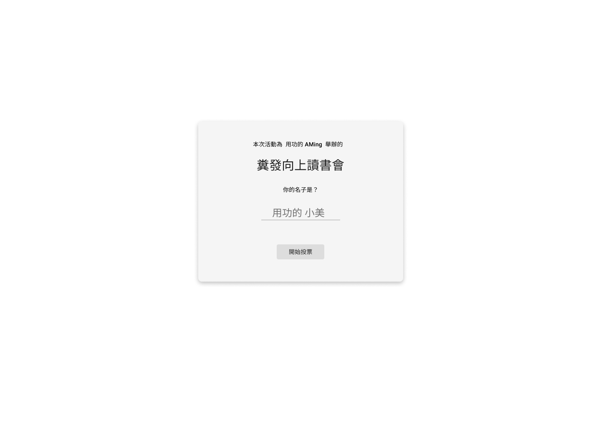
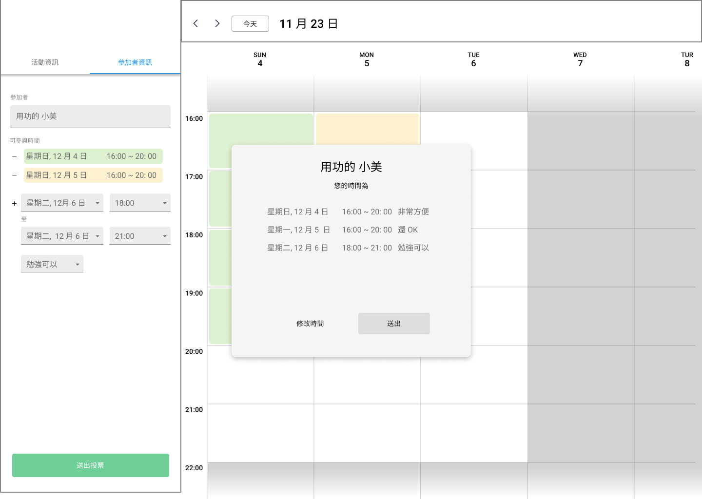

雖然 `12/7 17:00 ~ 18:00` 小美的時間比預計的活動時長還要短，但一樣可以填入自己方便的時間，讓主辦人做參考。

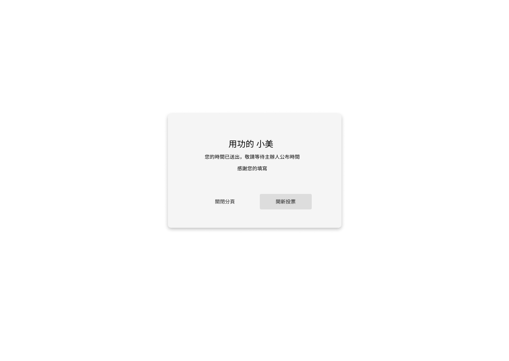

#### 步驟三：主辦人確認活動時間，生成活動資訊分享網址


當 11/26 填寫時間期限截止後，它可以檢視大家的統計資料，了解說哪個時段是大部分人方便的時間，來訂出一個最多人能夠參與的活動時間。如果發現並沒有大家都能參與的 2 個小時，也可以考慮縮短活動時間，來提高大家的參與率。


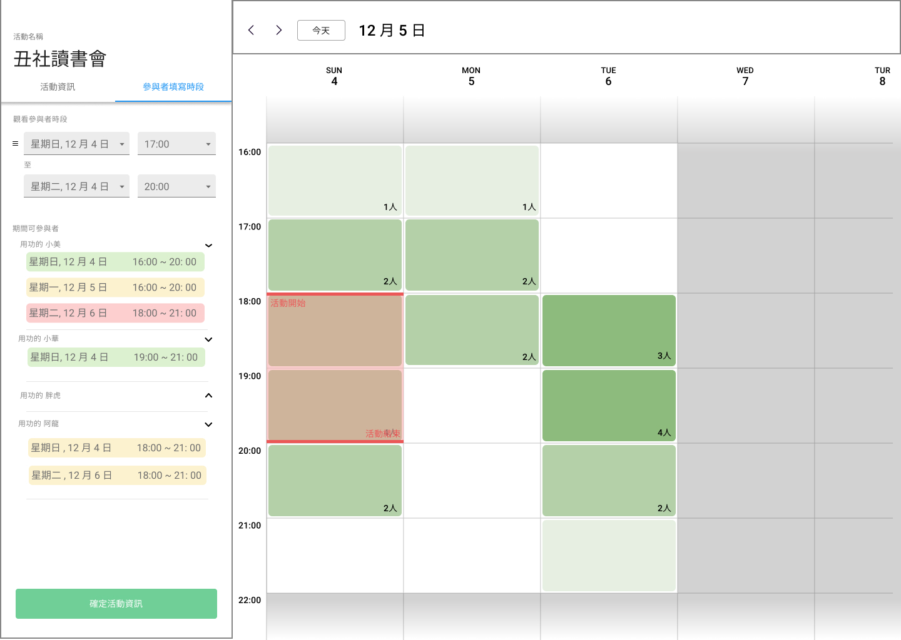


看完每位參加者的時間後，就能夠確定活動資訊


```
- 活動名稱：糞發項上讀書會  
- 活動主辦人：用功的 Ming
- 活動時間：12/9(三) 17:00 到 18:30 之間  
- 活動備註：在圖書館的閱覽室，帶自己要分享的書
```

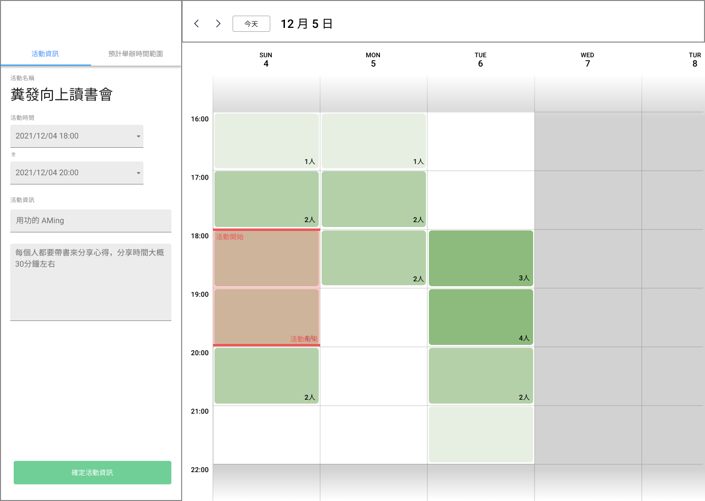

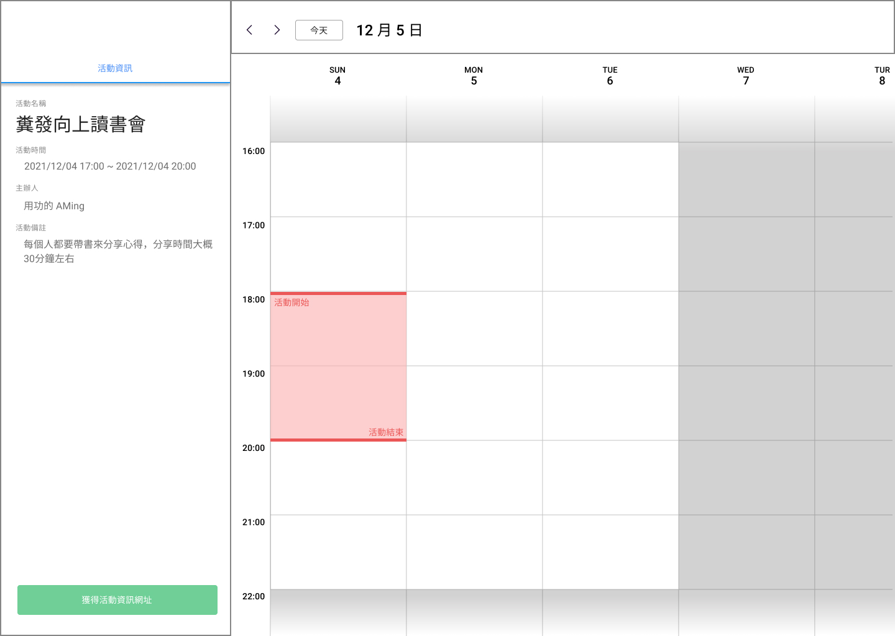


確認活動資訊後，原本的填寫時間網址就會變成活動資訊網址，點擊網址之後就可以知道之前投票的活動資訊，看到確定的活動資訊。

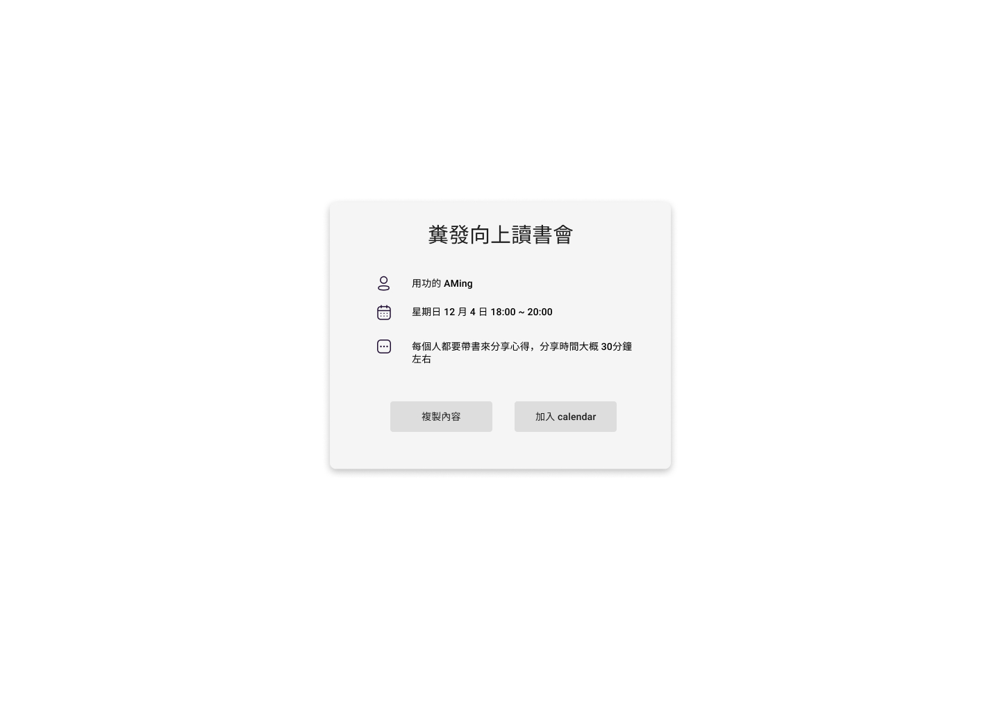
## 3. User story

### P0

先滿足 Pickel 的基本功能

- P0 身為主辦人，我希望可以選擇基本的時間 range（像是以日 or 上午 下午 等等一個比較大的 range），然後再由其他人來填寫活動時間
- P0 身為主辦人，我希望可以設定活動名稱、活動主辦人、以及活動備註
- P0 身為主辦人，我希望可以在開放填寫中以及填寫時能夠觀看參與者填寫的時間狀況
- P0 身為主辦人，我希望可以點擊連結，進入自己的活動主辦頁面
- P0 身為主辦人，我希望可以清楚分辨活動主辦頁和活動時間填寫頁
- P0 身為主辦人，我希望可以提早停止填寫時間
- P0 身為主辦人，我希望可以設定馬上開始填寫時間
- P0 身為參與者，我希望可以透過連結，來進入填寫時間的頁面
- P0 身為參與者，我希望可以選擇多個自己方便的時間
- P0 身為參與者，我希望可以在選擇時間時標記這個時間是**完全方便**、**還 OK** 還是 **勉強可以**


### P1

這部份重心放在 UI 上，建立更方便的基本使用者流程。

- P1 身為主辦人，我希望不只是以文字表現每位參與者的時間，而且以行事歷的方式呈現每段時間的填寫狀況（參考 google 日曆）
- P1 身為主辦人，我希望可以把自己設定的時間資訊（時間填寫期限，預計活動時間）呈現在行事曆上。
- P1 身為使用者，我希望可以用滑鼠拖曳的方式，來設定我想要的時間
- P1 身為使用者，希望在行事曆上能夠標注今天在行事曆上的位置，並且能夠迅速切換到今天的頁面 
- P1 身為使用者，希望行事曆能夠有以週、月兩種單位的呈現方式。
- P1 身為主辦人，我希望可以篩選參與者的結果，顯示符合特定要求（像是時間）
- P1 身為主辦人，我可以取消發起的活動，我不辦了

### p2

- P1 身為主辦人，希望能夠簡單以：上午/下午/晚上 這樣的方式迅速新增活動預計時間。
- p2 身為主辦人，我希望我可以選擇說在投票時要不要看到統計結果
- P2 身為主辦人，我希望可以選擇匿名投票或者是公開名稱
- P2 身為主辦人，我希望可以新增地點的資訊，並且可以透過 google 地圖檢視地點
- P2 身為主辦人，我希望不必檢視每個人填寫的時間，系統會根據參與者的填寫結果加權後推薦時間區段，直接選擇活動的時間
- P2 身為參與者，我希望可以填寫 email，讓我在活動資訊確定之後，自動寄送活動資訊的郵件到信箱裡。


### p3 

- P3 身為使用者我希望我可以贊助開發者咖啡，好感謝他們喔
- P3 身為參與者，我希望能夠紀錄過去曾參與投票的最終活動資訊
- P3 身為主辦人，我希望可以客製化網址
- P3不論身為票選者還是主辦人，我希望在活動確定後，能夠把活動資訊加入我的 google Calendar 裡面
- P3 身為使用者，我希望可以有英文和中文版本


## 4. 產品名詞定義
  
**活動(event)**：

每次想要約時間聚會，就稱作一次的「活動」，「活動」中會有兩個不同的角色，分別是主辦人和參與者。

   而每一次的「活動」都有以下資訊
  - 活動名稱(Event name)：活動的名稱
  - 活動主辦人(launcher)：主辦人的名稱
  - 預計時間範圍(holding range)：活動可能舉辦的時間區間。有可能是幾分鐘、幾小時、或者是幾天
  - 預計活動時長/活動時長(event duration)：在最初建立活動時可以設定預計活動時長。而主辦人可以在填時間結束後的確定活動資訊階段中，更改活動時間。
  - 填時間期限(picking range)：在這段期限，參與者才能夠進入網址填寫自己方便的時間。
  - 活動備註(event note)：其他的活動備註資訊
  - 活動連結(event link)：供主辦人設定活動的網址
  - 填時間連結(pick link)：供參與者填寫時間的網址

在活動中有兩個角色，各自有不同的行動

- **主辦人(launcher)**：  
在活動中，建立一個活動，讓其他參與者**填時間**的角色，並且在填時間期限結束後能夠**確定活動資訊**
   - ㄌ活動(launch)：  
   從 pickel 的網站來建立要舉辦活動
   - 設定活動資訊
   - 確定活動資訊(determine)：  
   最終確定活動資訊

- **參與者(picker)**：  
  建立活動後，填寫活動時間給主辦人參考並確認活動時間的角色
  - 填時間(pick)：
   在 Pickel 上面填寫自己方便的時間，供主辦人做確定活動資訊的參考


而一場活動則有五個階段
- 活動建立(creating) 
  建立活動的草稿階段，期間可以建立活動以儲存資料進入活動準備階段，沒有建立活動就離開頁面會丟棄資料
- 活動準備(prepicking)  
  主辦人已經建立活動，但是還沒到開放投票的時間，期間可以
  - 主辦人可以修改資訊
  - 此階段起主辦人可以拿到活動連結，並可透過連結回到活動設定頁面
  - 主辦人可以拿到填時間連結
- 填時間期間(picking)
  - 主辦人**不能**修改資訊
  - 主辦人可以在這個階段看到參與者填的時間
  - 主辦人可以暫停填寫，回到活動準備的階段
  - 主辦人可以提早結束，進到結束填寫的階段
  - 參與者可以用填時間連結來填寫時間
- 結束填寫(postpicking)
  - 主辦人可以看到參與者填的時間
  - 主辦人**可以**修改活動資訊
  - 主辦人可以確定活動資訊，進到活動確定階段
- 活動確定(determined)
  - 主辦人可以看到參與者填的時間
  - 主辦人**不能**修改活動資訊
  - 參與者可以用**填時間連結**來觀看最後的活動資訊


## 5. 功能架構圖 Function map
[link](https://miro.com/app/board/o9J_kgiqsN0=/)


## 6. 產品信息架構圖 IA
[Miro link](https://miro.com/app/board/o9J_kgiqsN0=/)


## 7. 線框稿 Wireframe
[Figma 連結](https://www.figma.com/file/7ovucbOLb0CJ3fGWbpjKzq/Pickel?node-id=418%3A5195)


5c480eb
e656c89