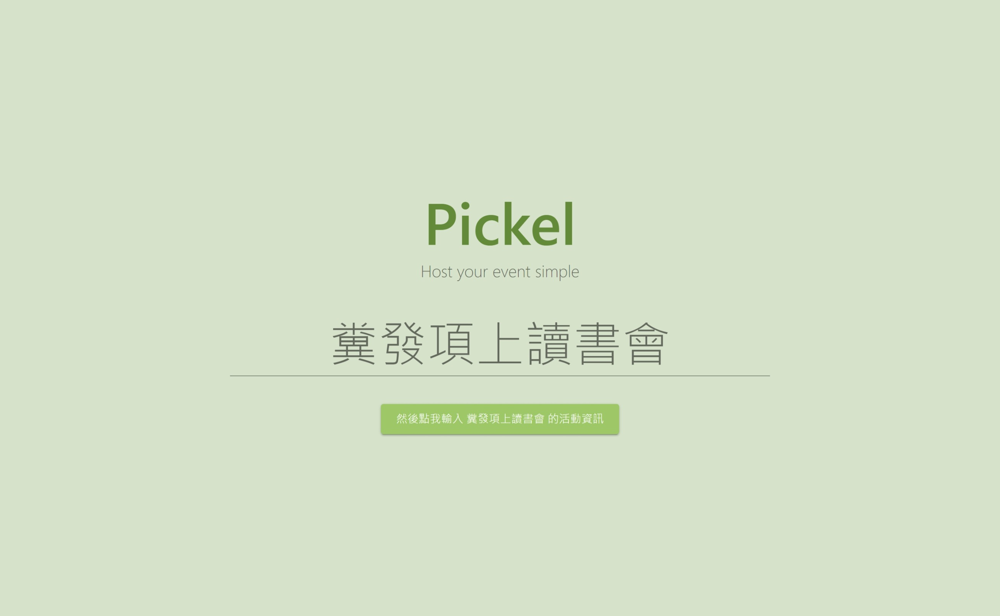
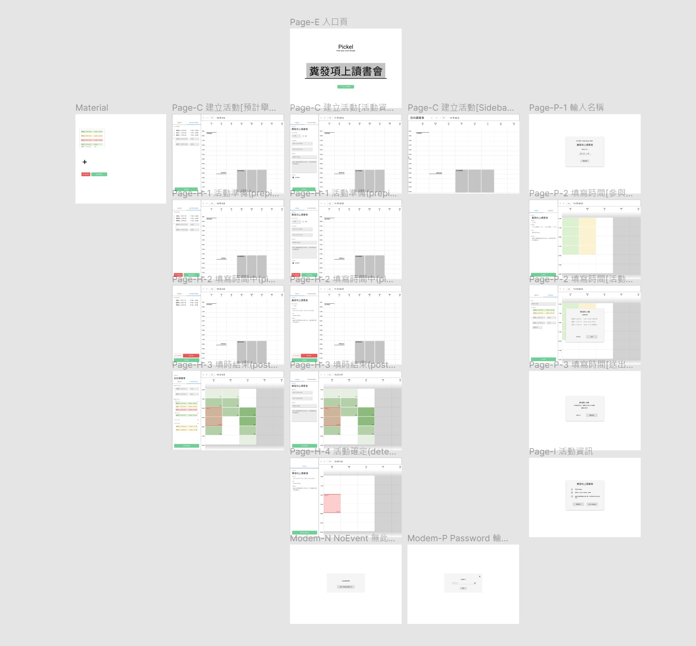

<p align="center">
  
</p>


# Pickel

本專案為程式導師實驗計畫第四期 Final Project，整個專案共有三個 Repo：

- 專案規劃：https://github.com/Lauviah0622/Pickel
- 前端：https://github.com/Lauviah0622/pickel-frontend
- 後端：https://github.com/Lauviah0622/pickel_backend

專案尚未完成，當前開發測試 Demo：https://test-pickel.lauviah.io/#/


## TOC
  * [1\. 專案簡介](#1-專案簡介)
  * [2\. 專案說明](#2-專案說明)
    * [產品目標](#產品目標)
    * [使用流程](#使用流程)
    * [使用範例](#使用範例)
      * [步驟一：主辦者建立活動](#步驟一主辦者建立活動)
      * [步驟二：參與者投票](#步驟二參與者投票)
      * [步驟三：主辦人確認活動時間，生成活動資訊分享網址](#步驟三主辦人確認活動時間生成活動資訊分享網址)
  * [3\. 產品功能規劃](#3-產品功能規劃)
  * [4\. 產品名詞定義](#4-產品名詞定義)
  * [5\. 功能架構圖 Function map](#5-功能架構圖-function-map)
  * [6\. 產品信息架構圖 IA](#6-產品信息架構圖-ia)
  * [7\. 線框稿 Wireframe](#7-線框稿-wireframe)

## 1. 專案簡介

Pickel 是一個選擇聚會時間的線上小工具，由一位主辦者發起活動後，讓能夠讓每一位活動的參與者都提出自己方便的時間區段，最後由活動的主辦者決定最後的活動時間。

## 2. 專案說明

三五好友想要找時間吃個飯，最常用的就是挑日子。但是過往挑日子的方式，總是會出現一些問題，沒辦法挑到一個大家都方便的時間：

#### 主辦人很難完全蒐集到大家都滿意的選項

```
小明：好久沒約了各位～下禮拜要不要吃飯，約個晚上好了？
小美、小華：好啊 OK
小明：那我開個選日子，你們選一下自己 OK 的時間，不行的話可以自己新增選項。

〔小明建立了一個活動〕

小華：能不能再開一個星期三呀，那天可能會比較有空一點。
小明：好阿，我在重開一個挑日子好了


〔小明建立了一個活動〕

小美：這星期四跟星期五的時間可以，可是公司沒有那麼早下班，能不能再晚個半小時？
小明：err，好（是到底要建立幾次？？？？？

〔小明建立了一個活動〕


```
#### 投票結果多個選項票數相同，不知道要選哪一個
```
〔投票結束〕
星期六：小明、小華
星期五：小明、小美
星期四：小美
星期二：小明

小明：目前看起來是星期六和星期五比較 OK，不過就沒辦法全到，你們覺得呢？
小華：星期六我可能不行耶，那天要和家人出去。
小美：星期五喔...好啦我問問看我們主管，看看能不能稍微早一點走，可能要欠同事一次人情了。
```

#### 只能參與部分活動的人，影響的了想要完整參與的人

```
小明：小華，我跟小美已經到了半小時了，你還沒到嗎？
小華：歹勢，我可能還要再半小時，你們先點餐，不用等我沒關係

小美：（...我還特地跟公司提早半小時離開欸...，配合你的時間結果這樣）
```

這些都是用挑日子的方式會出現的問題，顯然的，用投票的方式來選時間並不是約定時間最好的方式。
### 產品目標


在過往投票的模式中，往往只有主辦者，或只有團體的少部份人提出少數的選項。最後進入表決的選項往往不夠好或者是沒辦法滿足大部分人的需求。

Pickel 的目標是：

> 用最簡單快速的方式，盡可能讓成員以最小的阻力來參與活動。

主辦者能夠發送網址連結傳給想要參與的成員，讓成員能夠以簡單的圖形化界面來填入自己方便的時間。而在成員填寫完畢後，主辦者也能夠時間的統計資料來選出最多人能夠參與的活動時間。

### 使用流程


### 使用範例

> 因產品尚未完成，部份示意圖為 wireframe

#### 步驟一：主辦者建立活動

小明以及他的快樂夥伴們開始奮發向上，想要辦一場讀書會，想著想著決定用 Pickel 來選出這場讀書會的時間。



大家預計舉辦在平日的晚上： **12/5(一) ～ 12/9(五) 下午 5:00 到 晚上 10:00 之間**，而讀書會的時間預計為 **2hr**。於是小明可以發起一個活動，並設定：

```
- 活動名稱: 糞發項上讀書會
- 活動主辦人: 用功的 AMing
- 預計活動時間: 12/4(日) ～ 12/9(二) 17:00 到 22:00 之間
- 預計活動時長: 2hr
- 填寫時間期限: 12/1(四) 9:00 ~ 12/5(五) 18:00
- 活動備註：在圖書館的閱覽室，帶自己要分享的書
```


當它設定活動好之後，可以點擊 `獲得網址`，將這個活動的連結發給他的快樂夥伴們。也可以點擊 `馬上開始投票`，讓收到連結的夥伴可以馬上開始填入自己方便的時段。

#### 步驟二：參與者投票

小美點開收到的連結後，先填寫自己的名稱，就可以填寫預計活動時間內，自己方便參加的時間：

```
- 12/7 17:00 ~ 21:00 （最方便）
- 12/8 20:00 ~ 22:00 （如果可以盡量不要選擇這個時間）
- 12/9 17:00 ~ 18:30 （還 OK）
```


雖然 `12/7 17:00 ~ 18:00` 小美的時間比預計的活動時長還要短，但一樣可以填入自己方便的時間，讓主辦人做參考。


#### 步驟三：主辦人確認活動時間，生成活動資訊分享網址

當 11/26 填寫時間期限截止後，它可以檢視大家的統計資料，了解說哪個時段是大部分人方便的時間，來訂出一個最多人能夠參與的活動時間。如果發現並沒有大家都能參與的 2 個小時，也可以考慮縮短活動時間，來提高大家的參與率。


看完每位參加者的時間後，就能夠確定活動資訊

```
- 活動名稱：糞發項上讀書會
- 活動主辦人：用功的 Ming
- 活動時間：12/9(三) 17:00 到 18:30 之間
- 活動備註：在圖書館的閱覽室，帶自己要分享的書
```


確認活動資訊後，原本的填寫時間網址就會變成活動資訊網址，點擊網址之後就可以知道之前投票的活動資訊，看到確定的活動資訊。


## 3. 產品功能規劃

## 4. 產品名詞定義

**活動(event)**：

每次想要約時間聚會，就稱作一次的「活動」，「活動」中會有兩個不同的角色，分別是主辦人和參與者。

而每一次的「活動」都有以下資訊

- 活動名稱(Event name)：活動的名稱
- 活動主辦人(launcher)：主辦人的名稱
- 預計時間範圍(holding range)：活動可能舉辦的時間區間。有可能是幾分鐘、幾小時、或者是幾天
- 預計活動時長/活動時長(event duration)：在最初建立活動時可以設定預計活動時長。而主辦人可以在填時間結束後的確定活動資訊階段中，更改活動時間。
- 填時間期限(picking range)：在這段期限，參與者才能夠進入網址填寫自己方便的時間。
- 活動備註(event note)：其他的活動備註資訊
- 活動連結(event link)：供主辦人設定活動的網址
- 填時間連結(pick link)：供參與者填寫時間的網址

在活動中有兩個角色，各自有不同的行動

- **主辦人(launcher)**：  
  在活動中，建立一個活動，讓其他參與者**填時間**的角色，並且在填時間期限結束後能夠**確定活動資訊**

  - ㄌ活動(launch)：  
    從 pickel 的網站來建立要舉辦活動
  - 設定活動資訊
  - 確定活動資訊(determine)：  
    最終確定活動資訊

- **參與者(picker)**：  
  建立活動後，填寫活動時間給主辦人參考並確認活動時間的角色
  - 填時間(pick)：
    在 Pickel 上面填寫自己方便的時間，供主辦人做確定活動資訊的參考

而一場活動則有五個階段

- 活動建立(creating)
  建立活動的草稿階段，期間可以建立活動以儲存資料進入活動準備階段，沒有建立活動就離開頁面會丟棄資料
- 活動準備(prepicking)  
  主辦人已經建立活動，但是還沒到開放投票的時間，期間可以
  - 主辦人可以修改資訊
  - 此階段起主辦人可以拿到活動連結，並可透過連結回到活動設定頁面
  - 主辦人可以拿到填時間連結
- 填時間期間(picking)
  - 主辦人**不能**修改資訊
  - 主辦人可以在這個階段看到參與者填的時間
  - 主辦人可以暫停填寫，回到活動準備的階段
  - 主辦人可以提早結束，進到結束填寫的階段
  - 參與者可以用填時間連結來填寫時間
- 結束填寫(postpicking)
  - 主辦人可以看到參與者填的時間
  - 主辦人**可以**修改活動資訊
  - 主辦人可以確定活動資訊，進到活動確定階段
- 活動確定(determined)
  - 主辦人可以看到參與者填的時間
  - 主辦人**不能**修改活動資訊
  - 參與者可以用**填時間連結**來觀看最後的活動資訊

## 5. 功能架構圖 Function map

[Function map 連結](https://miro.com/app/board/o9J_kgiqsN0=/)


## 6. 產品信息架構圖 IA

[信息架構圖連結](https://miro.com/app/board/o9J_kgiqsN0=/)


## 7. 線框稿 Wireframe

[Figma 連結](https://www.figma.com/file/7ovucbOLb0CJ3fGWbpjKzq/Pickel?node-id=418%3A5195)

)